# 👋 ¡Hola! Soy Pepe

Soy fisioterapeuta de formación que decidió dar un giro a su vida profesional para adentrarse en el mundo de **la tecnología**. Durante años me he dedicado a la salud, pero descubrí que programar me ofrece algo que siempre me ha motivado: **crear soluciones prácticas que satisfagan las necesidades reales de las personas**, aunque esta vez desde el software.  

Llevo cerca de un año formándome y desarrollando proyectos personales con **HTML, CSS (Tailwind, SASS), JavaScript y React (con MUI)**, aplicando mi creatividad para transformar ideas en aplicaciones reales.  

Mi objetivo es comenzar mi carrera como **Desarrollador Frontend**, seguir creciendo hacia el **Backend** y evolucionar hasta convertirme en **Fullstack Developer**, ampliando así mis herramientas y campos de acción.

---

### 💻 Stack actual

- **Frontend**:  
  
  
  
  
  
  
  

- **Otros**:  
  

---

### 🚀 Proyectos personales

#### 📊 Gestor de objetivos de ahorro
Aplicación para planificar y seguir objetivos de ahorro. Incluye tablas dinámicas, líneas de progreso, formularios controlados, almacenamiento local y modo claro/oscuro.  

  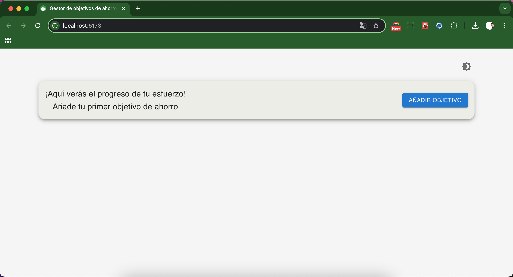
  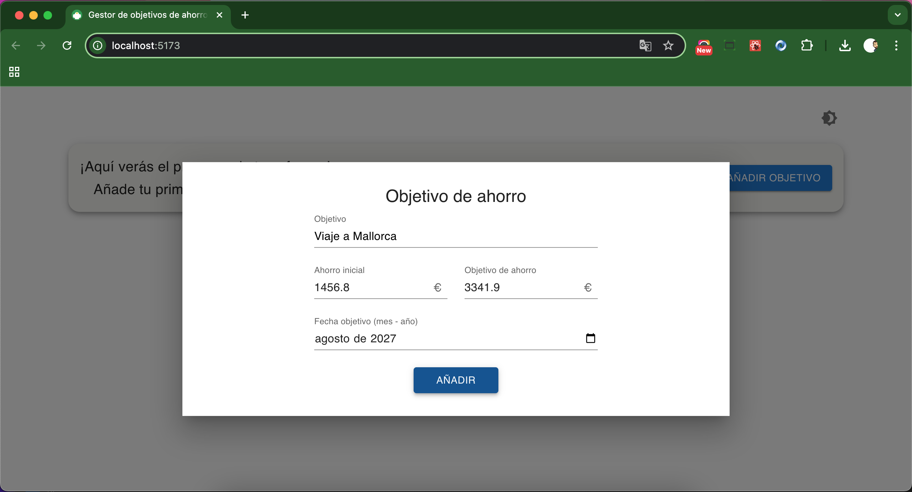

  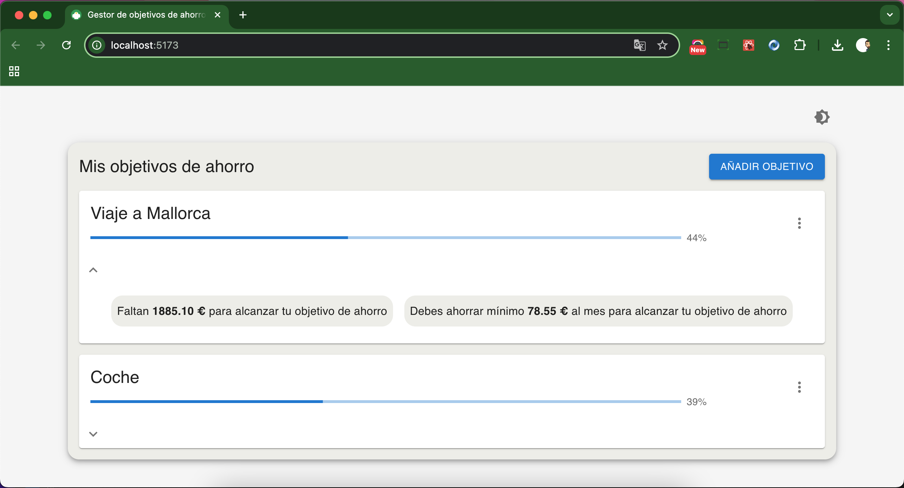
  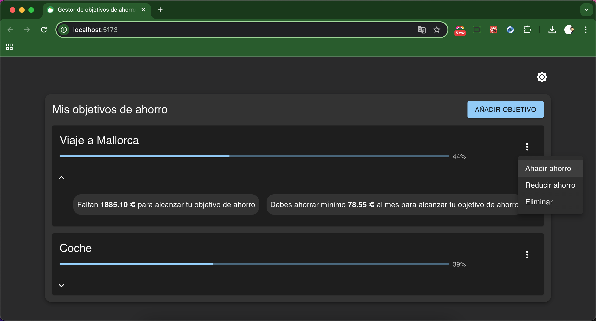

  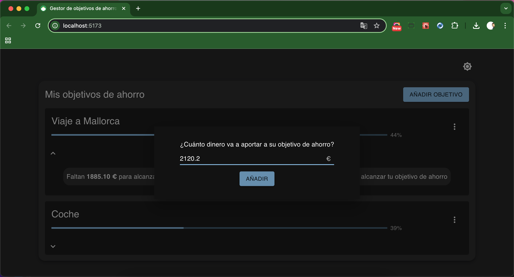
  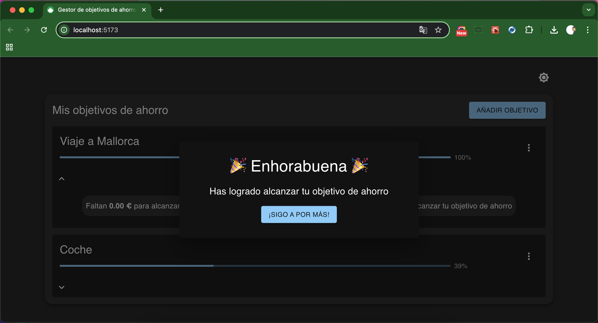

🔗 [Gestor de objetivos de ahorro](https://github.com/doblep97/calculadora_objetivos_ahorro)

---

#### 📈 Seguimiento de inversiones
App para llevar un control de inversiones con gráficas, tablas y almacenamiento local.  

  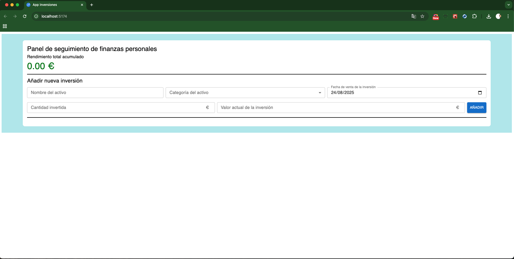
  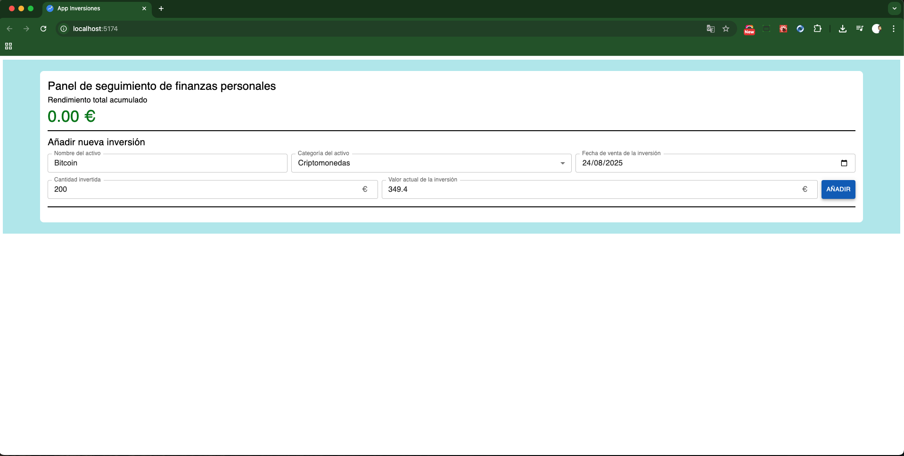

  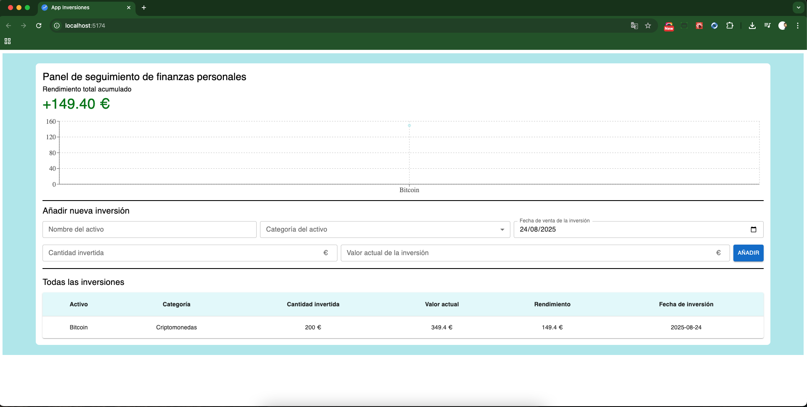
  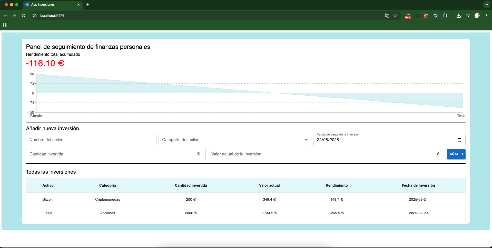

  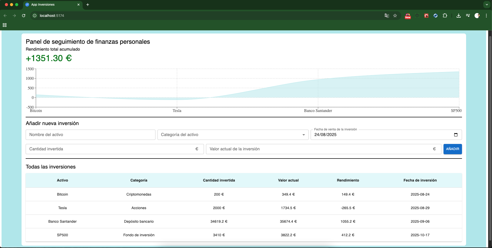

🔗 [Seguimiento de inversiones](https://github.com/doblep97/investments_app)

---

#### ✅ Gestor de tareas
CRUD de tareas con creación, edición y borrado, almacenamiento local y drag & drop para organizar.  

🔗 [Gestor de tareas](https://github.com/doblep97/Proyecto-gestor-tareas_vite-react-tailwind)

---

#### 🎨 Diseño y estilaje de webs
Prácticas centradas en **HTML, CSS y SASS** para lograr interfaces modernas y responsivas.  

- 🔗 [Modern Art Gallery Project](https://github.com/doblep97/Modern-Art-Gallery-Project)  
- 🔗 [GathSessions Project](https://github.com/doblep97/GathSessions-Project)

---

### 🎯 Objetivos
- 💻 Iniciar mi carrera profesional como **Desarrollador Frontend**, aplicando mis conocimientos en React, JavaScript, MUI, entre otros.  
- 🔄 Mantener siempre un ojo en el **Backend**, con la meta de evolucionar al puesto de **Fullstack Developer** y abarcar todo el campo del desarrollo de software.  
- 📊 Formar parte de proyectos vinculados a las **finanzas**, 🚀 **startups** (donde mi perfil creativo puede aportar un gran valor) o ❤️ el **sector salud**, combinando mi experiencia en fisioterapia con la tecnología.  
- 🌍 Desarrollar mi carrera en un entorno **remoto o híbrido**, que me permita colaborar de forma cercana con el equipo y al mismo tiempo disponer de flexibilidad.  

---

### 🌟 Sobre mí
- 🩺 De la **fisioterapia al software**: he aprendido a trabajar en equipo, a comunicarme con empatía, gestionar procesos de manera constante y establecer objetivos a lo largo del tiempo, habilidades que creo fundamentales en el desarrollo web.  
- 🎨 Soy una persona **creativa**, con facilidad para detectar mejoras en la funcionalidad de las aplicaciones y proponer ideas que aporten un valor añadido.  
- 💡 Lo que más me motiva es la posibilidad de **transformar necesidades reales de las personas en soluciones tecnológicas**, uniendo mi experiencia previa al trato con la gente con la programación.  
- 🤖 Veo la **tecnología y la IA** como motores fundamentales del futuro y quiero ser parte de este cambio, contribuyendo con proyectos que tengan un impacto positivo en la vida de la gente.  

---

### 📊 Stats de GitHub

  

---

📫 **Cómo contactarme**  

  
  

---

  
🇬🇧 English version

# 👋 Hi! I'm Pepe

I’m a physiotherapist who decided to make a career change and dive into the world of **technology**.  
For years I worked in healthcare, but I discovered that programming allows me to do something I’ve always enjoyed: **create practical solutions that meet real needs**, this time through software.  

I’ve been learning and building projects for almost a year with **HTML, CSS (Tailwind, SASS), JavaScript and React (MUI)**, applying my creativity to transform ideas into real applications.  

My goal is to start my career as a **Frontend Developer**, continue growing into **Backend**, and eventually become a **Fullstack Developer**, expanding my tools and knowledge.  

---

### 💻 Tech Stack

- **Frontend**:  
  
  
  
  
  
  
  

- **Other**:  
  

---

### 🚀 Personal Projects
#### 📊 Savings Goals Manager
App to plan and track savings goals. Includes dynamic tables, progress lines, controlled forms, local storage and light/dark mode.  

#### 📈 Investment Tracker
App to keep track of investments with charts, tables and local storage.  

#### ✅ Task Manager
CRUD app for tasks with create, edit and delete, local storage and drag & drop organization.  

#### 🎨 Web Styling
UI practice projects focused on **HTML, CSS and SASS** to build modern and responsive interfaces.  

---

### 🎯 Goals
- 💻 Start my career as a **Frontend Developer** applying React, JavaScript and MUI.  
- 🔄 Keep an eye on the **Backend** to eventually grow into a **Fullstack Developer**.  
- 📊 Work on projects related to **personal finance**, 🚀 **startups** (where my creativity can add value), or ❤️ the **health sector**, combining my physiotherapy background with technology.  
- 🌍 Develop my career in **remote or hybrid environments**, collaborating closely with teams while keeping flexibility.  

---

### 🌟 About me
- 🩺 From **physiotherapy to software**: I learned teamwork, empathy and communication with patients, skills that now apply to development.  
- 🎨 I’m a **creative person**, quick to spot improvements in apps and propose ideas that add value.  
- 💡 Motivated by the chance to **turn real people’s needs into technology solutions**, combining my experience in healthcare with my passion for coding.  
- 🤖 I see **technology and AI** as key drivers of the future and I want to be part of this change by contributing to impactful projects.  

---

### 📊 GitHub Stats

  

---

📫 **Contact me**  

  
  

